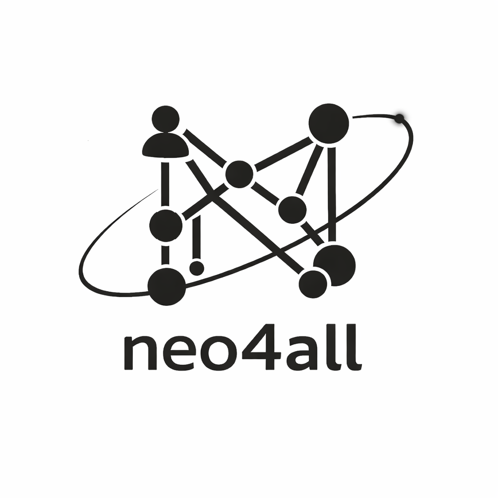

<p align="center">
  <picture>
    <source media="(prefers-color-scheme: dark)" srcset="docs/dark-mode-logo.png">
    <source media="(prefers-color-scheme: light)" srcset="docs/light-mode-logo.png">
    
  </picture>
</p>

<h1 align="center">neo4all</h1>

<p align="center">
  <strong>Turn any document into a governed knowledge graph. No Cypher. No guesswork. Full audit trail.</strong>
</p>

<p align="center">
  <a href="#quick-start">Quick Start</a> ·
  <a href="#how-it-works">How It Works</a> ·
  <a href="#api">API Reference</a> ·
  <a href="https://github.com/Muhanad-husn/neo4all/issues">Issues</a>
</p>

---

## What is neo4all?

Most knowledge graph tools ask you to write Cypher, wrangle ETL pipelines, and hope the AI didn't hallucinate bad relationships into your data. **neo4all takes a different approach.**

Drop in your documents — PDFs, DOCX, spreadsheets, HTML, images, whatever you have — and neo4all's AI extracts entities and relationships into Neo4j, then **surfaces every data quality issue for you to review before anything touches the graph.** Merges, deduplication, canonical fixes: every mutation flows through a governed pipeline with human approval and a permanent audit trail.

**This is knowledge graph construction you can actually trust.**

### Why neo4all?

- **AI does the heavy lifting, humans keep control.** AI proposes schema, extracts entities, and suggests fixes — but nothing changes in your graph without explicit approval.
- **20+ file formats out of the box.** Three-tier parser fallback (Docling → Unstructured → raw text) means nearly anything you throw at it just works.
- **Deterministic by design.** Same input always produces the same IDs, same diffs, same candidates. No `uuid4()` randomness. Every artifact is reproducible.
- **Five zero-LLM quality detectors** catch exact duplicates, probable duplicates (Jaro-Winkler + token overlap), schema violations, orphan nodes, and structural anomalies — before any AI curation runs.
- **Full governed pipeline**: `Proposal → Approval → Diff → Execution → Audit`. Two-phase confirmation for dangerous operations (merge, delete). Dry-run mode for zero-risk validation.
- **Open source. Run it locally with Docker, or deploy to AWS.** Your data never leaves your infrastructure.

---

## Quick Start

Using pre-built images from Docker Hub

Pre-built images are available on [Docker Hub](https://hub.docker.com/u/muhanaddocker):

This pulls all three images — `neo4all-api`, `neo4all-worker`, and `neo4all-ui`:

**Linux / macOS / Git Bash:**

```bash
for img in api worker ui; do docker pull muhanaddocker/neo4all-$img:latest; done
```

**Windows (CMD):**

```cmd
for %i in (api worker ui) do docker pull muhanaddocker/neo4all-%i:latest
```

**Windows (PowerShell):**

```powershell
foreach ($img in "api","worker","ui") { docker pull muhanaddocker/neo4all-${img}:latest }
```

Then:

```bash
# 1. Clone and configure
git clone https://github.com/Muhanad-husn/neo4all.git
cd neo4all
cp .env.example .env   # fill in your Neo4j Aura + OpenRouter credentials

# 2. Pull latest images and launch everything
docker compose pull   # Dont run this if you have pulled the images earlier
docker compose up -d

# 3. Open the app
open http://localhost:8501
```

> **Note:** `docker compose pull` is only needed if you skipped the pull commands above. Without it, `docker compose up -d` will reuse whatever images are cached locally and you may run an outdated version.

That's it. Five containers come up (FastAPI, Streamlit, Redis, RustFS, Qdrant), and you're ready to build a knowledge graph.

---

## How It Works

```
  Documents          AI Extraction        Quality Detection       Governed Curation
 ┌──────────┐      ┌──────────────┐      ┌─────────────────┐    ┌──────────────────┐
 │ PDF,DOCX │      │  LLM extracts│      │ 5 deterministic │    │ Proposal → Diff  │
 │ HTML,CSV │ ───► │  nodes/edges │ ───► │ detectors find  │ ──►│ → Approval →     │
 │ images.. │      │  per chunk   │      │ issues & dups   │    │ Execution → Audit│
 └──────────┘      └──────────────┘      └─────────────────┘    └──────────────────┘
     Phase 2            Phase 3              Phase 4 L1           Phase 4 L2/L3
```

| Phase                     | What happens                                                                                                                                                                    |
| ------------------------- | ------------------------------------------------------------------------------------------------------------------------------------------------------------------------------- |
| **0 — Connect**           | Enter Neo4j Aura credentials + OpenRouter API key. Session persists across browser restarts.                                                                                    |
| **1 — Define Schema**     | Describe your domain in plain language. AI proposes node/edge types. You edit and lock.                                                                                         |
| **2 — Ingest Documents**  | Upload files. Three-tier parser extracts structure. Chunks are embedded and indexed in Qdrant. You can return here from Curation to add more documents.                            |
| **3 — Extract Knowledge** | Chunks batched into single LLM calls (default 10/batch). Schema shared once per batch. Validated per-chunk. Written to Neo4j via idempotent MERGE.                                |
| **4 — Curate**            | Detectors surface issues. Review evidence. Propose fixes manually or let the AI agent pipeline handle batches. Every graph mutation is approved, diffed, executed, and audited. |

---

## Increment Status

All 8 increments are complete. The platform is fully functional end-to-end.

| Increment | Version | Description                                                  | Status     |
| --------- | ------- | ------------------------------------------------------------ | ---------- |
| SPEC-01   | 0.1.0   | Scaffolding, session lifecycle, logging, caching, monitoring | ✅ Complete |
| SPEC-02   | 0.2.0   | Domain schema definition                                     | ✅ Complete |
| SPEC-03   | 0.3.0   | Document ingestion & chunking                                | ✅ Complete |
| SPEC-04   | 0.4.0   | AI-assisted extraction & ARQ worker                          | ✅ Complete |
| SPEC-05   | 0.5.0   | Deterministic candidate generation                           | ✅ Complete |
| SPEC-06   | 0.6.0   | Manual curation & proposal pipeline                          | ✅ Complete |
| SPEC-07   | 0.7.0   | AI curation agent pipeline                                   | ✅ Complete |
| SPEC-08   | 0.8.0   | Monitoring polish, CI, documentation                         | ✅ Complete |

---

## Tech Stack

| Layer           | Technology                                  |
| --------------- | ------------------------------------------- |
| Frontend        | Streamlit + Plotly                          |
| Backend         | Python 3.12 / FastAPI                       |
| Worker          | ARQ + Redis                                 |
| Graph DB        | Neo4j Aura (cloud-only, no local container) |
| Vector Store    | Qdrant                                      |
| Object Storage  | boto3 → RustFS (local) / S3 (prod)          |
| LLM Gateway     | OpenRouter API                              |
| Package Manager | uv                                          |
| Caching         | Redis (shared with ARQ)                     |
| Observability   | structlog + in-memory metrics               |

---

## Prerequisites

- **Docker & Docker Compose** — one command brings up the full stack
- **[Neo4j Aura](https://console.neo4j.io) instance** — free tier works great for getting started
- **[OpenRouter](https://openrouter.ai/) API key** — LLM gateway for extraction and curation agents
- **[uv](https://docs.astral.sh/uv/)** — for local development without Docker

---

## Setup

### 1. Configure environment variables

```bash
cp .env.example .env
```

Fill in your credentials:

```bash
NEO4J_DEV_URI=neo4j+s://xxxx.databases.neo4j.io
NEO4J_DEV_USER=neo4j
NEO4J_DEV_PASSWORD=<your-password>
OPENROUTER_API_KEY=sk-or-...

# These are pre-configured for local Docker — only change if needed
S3_ENDPOINT_URL=http://localhost:9000
S3_ACCESS_KEY_ID=<key>
S3_SECRET_ACCESS_KEY=<secret>
S3_BUCKET_NAME=neo4all
REDIS_URL=redis://localhost:6379
```

### 2. Launch

```bash
docker compose up
```

Five services come up: **FastAPI** (`:8000`), **Streamlit** (`:8501`), **Redis** (`:6379`), **RustFS** (`:9000`), **Qdrant** (`:6333`). Neo4j runs on Aura — no local container needed.

### 3. Open the app

Head to **http://localhost:8501** and start building your knowledge graph.

### Local development (without Docker)

```bash
uv pip install -e ".[dev]"
api-server                  # FastAPI on :8000
streamlit run ui/app.py     # Streamlit on :8501
arq-worker                  # ARQ worker for extraction + agent jobs
```

> The ARQ worker must be running for extraction (Phase 3) and agent pipeline (Phase 4 L3) jobs.

---

## API

FastAPI auto-generates interactive docs at:

- Swagger UI: `http://localhost:8000/docs`
- ReDoc: `http://localhost:8000/redoc`

### Endpoints

#### Session (Phase 0)

| Method | Path                       | Description                             |
| ------ | -------------------------- | --------------------------------------- |
| GET    | `/api/session/{user_hash}` | Retrieve persisted session record       |
| POST   | `/api/session/save`        | Persist session state to Redis          |
| DELETE | `/api/session/{user_hash}` | Clear persisted session ("New Session") |

#### Health & Monitoring

| Method | Path                              | Description                                                     |
| ------ | --------------------------------- | --------------------------------------------------------------- |
| GET    | `/api/health`                     | Basic backend health check                                      |
| GET    | `/api/monitoring/health`          | Per-service connectivity with latency                           |
| GET    | `/api/monitoring/logs/recent`     | Recent log entries (filterable by level)                        |
| GET    | `/api/monitoring/run/{run_id}`    | Run-level summary                                               |
| GET    | `/api/monitoring/workers`         | ARQ queue depth and active worker count                         |
| GET    | `/api/monitoring/jobs/{run_id}`   | Per-chunk extraction job statuses                               |
| GET    | `/api/monitoring/metrics`         | Aggregated LLM usage per agent type (tokens, cost, invocations) |
| GET    | `/api/monitoring/agents/{run_id}` | Per-candidate agent chain telemetry for a run                   |
| GET    | `/api/monitoring/cache`           | Cache hit/miss ratio, key count, memory usage                   |

#### Schema (Phase 1)

| Method | Path                   | Description                                                  |
| ------ | ---------------------- | ------------------------------------------------------------ |
| POST   | `/api/schema/propose`  | Generate candidate schema via LLM for human review           |
| POST   | `/api/schema/approve`  | Lock the domain schema for a run (immutable after this call) |
| GET    | `/api/schema/{run_id}` | Retrieve locked schema (cache-first, no Neo4j query)         |

#### Documents (Phase 2)

| Method | Path                                      | Description                                               |
| ------ | ----------------------------------------- | --------------------------------------------------------- |
| POST   | `/api/documents/ingest`                   | Parse, chunk, and index an uploaded document              |
| GET    | `/api/documents/{run_id}`                 | List all successfully ingested documents for a run        |
| DELETE | `/api/documents/{run_id}/{doc_id}`        | Delete document manifest, chunks, and job statuses        |
| GET    | `/api/documents/{run_id}/{doc_id}/chunks` | Return chunk metadata with quality flag highlights        |

#### Extraction (Phase 3)

| Method | Path                               | Description                                     |
| ------ | ---------------------------------- | ----------------------------------------------- |
| POST   | `/api/extraction/run`              | Enqueue extraction jobs for all chunks in a run |
| GET    | `/api/extraction/status/{run_id}`  | Aggregated extraction progress for a run        |
| GET    | `/api/extraction/results/{run_id}` | Extracted nodes and edges written to Neo4j      |

#### Curation (Phase 4)

| Method | Path                                    | Description                                                            |
| ------ | --------------------------------------- | ---------------------------------------------------------------------- |
| POST   | `/api/curation/candidates/generate`     | Run all five deterministic detectors; cache results with 5-min TTL     |
| GET    | `/api/curation/candidates/{run_id}`     | Return cached candidates grouped by type and ordered by severity       |
| POST   | `/api/curation/propose`                 | Submit a manual Proposal Packet for a candidate                        |
| GET    | `/api/curation/proposals/{run_id}`      | List all proposals for a run (with state and diff summary)             |
| POST   | `/api/curation/proposals/{id}/execute`  | Build diff and execute an approved proposal via Agent-C                |
| GET    | `/api/curation/evidence/{candidate_id}` | Retrieve Qdrant evidence chunks for a candidate                        |
| POST   | `/api/curation/evidence/query`          | Ad-hoc evidence query by dedupe_key, doc, or semantic similarity       |
| POST   | `/api/curation/proposals/{id}/approve`  | Issue approval_id (single-step for low-risk; phase 1 for merge/delete) |
| POST   | `/api/curation/proposals/{id}/confirm`  | Phase 2 confirmation for high-risk proposals (merge, delete)           |
| POST   | `/api/curation/proposals/{id}/reject`   | Reject a proposal (terminal state)                                     |
| POST   | `/api/curation/proposals/{id}/defer`    | Defer a proposal for later review                                      |
| POST   | `/api/curation/proposals/{id}/exclude`  | Exclude a proposal — suppress its candidate from future detection      |
| POST   | `/api/curation/proposals/{id}/restore`  | Restore an excluded proposal back to pending                           |
| GET    | `/api/curation/proposals/{run_id}/excluded` | List all excluded proposals for a run                              |
| POST   | `/api/curation/orphans/delete-all`      | Bulk delete all orphan nodes through the governed pipeline             |

#### Graph Explorer

| Method | Path                              | Description                                                   |
| ------ | --------------------------------- | ------------------------------------------------------------- |
| GET    | `/api/graph/nodes/{run_id}/count` | Total node count by type for a run                            |
| GET    | `/api/graph/nodes/{run_id}`       | Paginated node browser (max 50/page, filterable by node_type) |
| GET    | `/api/graph/edges/{run_id}/count` | Total edge count by type for a run                            |
| GET    | `/api/graph/edges/{run_id}`       | Paginated edge browser (max 50/page, filterable by edge_type) |

---

## Deep Dive: The Pipeline

### Phase 0: Session Initialization

Connect to your Neo4j Aura instance and provide your OpenRouter API key. That's your session. Close the browser, come back later — your session is automatically restored from Redis. No credentials are stored in Redis, only session metadata.

---

### Phase 1: Domain Schema Definition

Tell neo4all what your domain is about — *"scientific papers on climate change"*, *"supply chain logistics for automotive parts"*, whatever — and the AI proposes a typed schema of node and edge types. Edit anything you want, then lock it. The schema is frozen for the entire run: deterministic `version_hash`, cached indefinitely, immutable. This is your contract with the graph.

---

### Phase 2: Document Ingestion & Chunking

Drop in your documents. PDFs, DOCX, PPTX, XLSX, CSV, HTML, Markdown, images — **20+ formats supported** through a three-tier parser fallback chain:

1. **Docling** — structural parsing with tables, headings, captions
2. **Unstructured** — broad format coverage as fallback
3. **Raw text** — PyPDF2/python-docx/UTF-8 decode as last resort

Each document is semantically chunked (respecting headings and table boundaries), embedded via sentence-transformers, and indexed in Qdrant. Quality flags (`raw_fallback`, `low_ocr_confidence`, `low_text_density`) surface potential issues without blocking the pipeline. Re-uploading the same file skips parsing entirely — incremental by design. You can also return to ingestion from the Curation phase to add more documents without starting over — extraction is idempotent and only processes new chunks.

---

### Phase 3: AI-Assisted Extraction

Hit "Extract" and neo4all groups your chunks into batches (default 10 per batch, configurable via `EXTRACTION_BATCH_SIZE`). Each batch is processed in a single LLM call — the schema is provided once and shared across all chunks, massively reducing redundant context. Per-chunk validation is fail-closed (malformed output for one chunk doesn't block siblings), and entities are written to Neo4j via idempotent `MERGE`. Real-time progress tracking in the UI shows you every chunk's status as it flows through.

---

### Phase 4: Curation — The Heart of neo4all

This is where neo4all really shines. Curation runs in three layers:

**Layer 1 — Deterministic Detection (zero LLM cost)**

Five detectors scan your graph and surface every issue they find:

- Exact node & relationship duplicates
- Probable duplicates (Jaro-Winkler >= 0.85, with token-overlap gate for lower-similarity pairs)
- Schema/canonical violations
- Structural anomalies (orphans, degree outliers, missing provenance)

Every candidate gets a deterministic ID — rerun detection and you get the same results.

**Layer 2 — Manual Curation**

Review evidence from Qdrant, submit proposals (canonicalize, normalize, rename, merge, delete, defer), and approve them through the governed pipeline. High-risk operations (merge, delete) require two-phase confirmation. Every mutation produces an immutable audit record in S3.

**Layer 3 — AI Agent Pipeline**

For batch processing, the multi-agent chain handles it:

- **Orchestrator** (non-LLM) assigns risk class and token budget
- **Agent-A** assembles and classifies evidence (structural signals from detectors are treated as first-class evidence)
- **Structural Recommendation** (non-LLM) pre-digests collision_context metrics into a concrete action recommendation (merge, canonicalize, normalize, delete, defer) with deterministic confidence — this is the primary input for Agent-P
- **Agent-B** retrieval augmentation (user-toggleable via checkbox in the curation UI; most effective once curation-panel evidence-only ingestion is available — see [Roadmap](#roadmap))
- **Agent-P** composes a governed proposal using the structural recommendation as its anchor — with regex safety guards that reject any Cypher or executable code

AI proposals flow through the exact same approval pipeline as manual ones. No shortcuts. Full telemetry (tokens, cost, execution time) is tracked per agent per candidate.

---

## UI Pages

| Page           | Path                         | Description                                                                       |
| -------------- | ---------------------------- | --------------------------------------------------------------------------------- |
| Dashboard      | `ui/pages/dashboard.py`      | Tabbed hub: Overview, Schema, Ingestion, Extraction, Curation, Graph (Plotly charts) |
| Schema         | `ui/pages/schema.py`         | Phase 1: domain description → AI proposal → edit → lock                           |
| Ingestion      | `ui/pages/ingestion.py`      | Phase 2: upload documents, view chunks and quality flags                          |
| Extraction     | `ui/pages/extraction.py`     | Phase 3: trigger extraction, monitor per-chunk job progress                       |
| Curation       | `ui/pages/curation.py`       | Phase 4: candidate review, evidence, proposals, approval pipeline, agent dispatch |
| Graph Explorer | `ui/pages/graph_explorer.py` | Paginated node/edge browser with type filter                                      |

All pages use `StateManager` for session state (no direct `st.session_state` access) and communicate with the backend exclusively via HTTP.

---

## Docker Images

Three Docker images are published to [Docker Hub](https://hub.docker.com/u/muhanaddocker):

| Image                                                                                   | Dockerfile          | Description                                                    |
| --------------------------------------------------------------------------------------- | ------------------- | -------------------------------------------------------------- |
| [`muhanaddocker/neo4all-api`](https://hub.docker.com/r/muhanaddocker/neo4all-api)       | `Dockerfile.api`    | FastAPI backend (all business logic, graph writes, validation) |
| [`muhanaddocker/neo4all-worker`](https://hub.docker.com/r/muhanaddocker/neo4all-worker) | `Dockerfile.worker` | ARQ worker (extraction + agent pipeline jobs)                  |
| [`muhanaddocker/neo4all-ui`](https://hub.docker.com/r/muhanaddocker/neo4all-ui)         | `Dockerfile.ui`     | Streamlit frontend (UI only)                                   |

**Tags:** `1.0.5`, `latest`

All images use CPU-only PyTorch (~3 GB each) instead of the default CUDA build (~13 GB). The embedding model (`all-MiniLM-L6-v2`) runs identically on CPU.

To build locally instead of pulling:

```bash
docker build -f Dockerfile.api    -t muhanaddocker/neo4all-api:latest    .
docker build -f Dockerfile.worker -t muhanaddocker/neo4all-worker:latest .
docker build -f Dockerfile.ui     -t muhanaddocker/neo4all-ui:latest     .
```

---

## CI Pipeline

GitHub Actions (`.github/workflows/ci.yml`) runs on push/PR to `main`:

| Job                 | Description                                                                          |
| ------------------- | ------------------------------------------------------------------------------------ |
| `lint`              | `ruff check .`                                                                       |
| `typecheck`         | `mypy api/ ui/` (strict mode)                                                        |
| `unit-tests`        | `pytest tests/unit/` with Redis service container                                    |
| `integration-tests` | `pytest tests/integration/` — **skipped** unless `NEO4J_CI_*` secrets are configured |
| `docker-build`      | `docker compose build`                                                               |

---

## Dry-Run Mode

Set `DRY_RUN=true` to run the full pipeline without graph mutations. Agent-C skips all Neo4j writes. Diffs and proposals are still generated, logged to S3, and visible in the UI. Useful for:

- Validating the pipeline end-to-end before committing to graph changes
- Reviewing what mutations *would* happen on a new dataset
- CI environments without a live Neo4j instance

---

## Environment Variables

| Variable               | Required | Default            | Description                                                  |
| ---------------------- | -------- | ------------------ | ------------------------------------------------------------ |
| `NEO4J_DEV_URI`        | Yes      | —                  | Neo4j Aura connection URI                                    |
| `NEO4J_DEV_USER`       | Yes      | —                  | Neo4j username                                               |
| `NEO4J_DEV_PASSWORD`   | Yes      | —                  | Neo4j password                                               |
| `NEO4J_CI_URI`         | No       | —                  | CI Neo4j URI (integration tests skip if absent)              |
| `NEO4J_CI_USER`        | No       | —                  | CI Neo4j username                                            |
| `NEO4J_CI_PASSWORD`    | No       | —                  | CI Neo4j password                                            |
| `OPENROUTER_API_KEY`   | Yes      | —                  | LLM gateway API key                                          |
| `S3_ENDPOINT_URL`      | Yes      | —                  | Object storage endpoint (`http://localhost:9000` for RustFS) |
| `S3_ACCESS_KEY_ID`     | Yes      | —                  | Object storage access key                                    |
| `S3_SECRET_ACCESS_KEY` | Yes      | —                  | Object storage secret key                                    |
| `S3_BUCKET_NAME`       | Yes      | —                  | Object storage bucket name                                   |
| `REDIS_URL`            | Yes      | —                  | Redis connection URL                                         |
| `QDRANT_URL`           | No       | —                  | Remote Qdrant instance URL                                   |
| `LOG_FORMAT`           | No       | `json`             | `json` (production) or `console` (development)               |
| `LOG_LEVEL`            | No       | `INFO`             | `DEBUG`, `INFO`, `WARNING`, `ERROR`, `CRITICAL`              |
| `ENABLE_DOCLING`       | No       | `true`             | Enable Docling parser tier                                   |
| `ENABLE_UNSTRUCTURED`  | No       | `true`             | Enable Unstructured parser tier                              |
| `ENABLE_RAW_FALLBACK`  | No       | `true`             | Enable raw-text fallback parser tier                         |
| `EMBEDDING_MODEL`      | No       | `all-MiniLM-L6-v2` | Sentence-transformers model for chunk embeddings             |
| `EXTRACTION_BATCH_SIZE`| No       | `10`               | Chunks per LLM call in batch extraction (1–50)               |
| `DRY_RUN`              | No       | `false`            | Skip graph mutations; log diffs to S3                        |

---

## Development Workflow

```bash
# Install dependencies (local dev)
uv pip install -e ".[dev]"

# Run linting and type checks
ruff check .
mypy api/ ui/

# Run unit tests (no network required)
pytest tests/unit/ -v

# Run integration tests (requires Neo4j Aura + Redis)
pytest tests/integration/ -v

# Start all services via Docker
docker compose up
```

### Hotpatching (Fast Code Updates)

When you change only Python source files (`api/`, `ui/`), skip the full Docker rebuild:

```bash
# Copy updated code into running containers and restart (~2 seconds)
./hotpatch.sh
```

Only rebuild images when `pyproject.toml` or Dockerfiles change:

```bash
docker compose up -d --build api ui
```

---

## Architecture Decision Records

| ADR                                              | Decision                                                      |
| ------------------------------------------------ | ------------------------------------------------------------- |
| [ADR-001](docs/adr/001-parser-fallback-chain.md) | Three-tier parser fallback: Docling → Unstructured → raw text |
| [ADR-002](docs/adr/002-no-local-neo4j.md)        | Neo4j Aura only — no local graph database container           |
| [ADR-003](docs/adr/003-deterministic-ids.md)     | SHA-256 content-derived IDs for all governed artifacts        |

---

## Roadmap

**Next milestone: Curation-panel evidence-only ingestion + Agent-B activation**

Phase re-entry now allows users to navigate back from Curation to Ingestion to add more documents within the same run. New documents go through the full extraction pipeline (only new chunks are processed — existing work is preserved). This supports iterative graph building.

The next milestone extends this with *evidence-only* ingestion directly from the curation UI: new documents would be chunked and embedded into Qdrant *without* triggering extraction, serving purely as supplementary evidence for entity resolution. When such evidence-only documents exist in the vector store, Agent-B activates and searches them for evidence that supports or contradicts the structural recommendation. This completes the evidence loop: deterministic detectors flag issues, structural recommendations propose actions, and user-provided documents supply the textual evidence that was previously missing.

---

## Known Limitations (v1.0.5)

- Per-page locators from Docling/Unstructured are approximated; exact page-level attribution is not yet tracked per chunk
- Edge type filter in graph explorer is a Python-side slice (no dedicated graph reader method)
- Qdrant collections (`chunks_{run_id}`) are not cleaned up on run deletion
- `GET /api/monitoring/run/{run_id}` returns `found=false` until a server-side run registry is added
- Agent-B (retrieval augmentation) can be toggled per-run via the "Enable retrieval augmentation" checkbox in the curation UI (server default: `ENABLE_AGENT_B` env var). It is most useful once curation-panel evidence-only ingestion is implemented (see [Roadmap](#roadmap))

---

## Project Structure

```
neo4all/
├── api/                    # FastAPI backend — all business logic lives here
│   ├── agents/             #   Agent-A, B, P, C + orchestrator
│   ├── graph/              #   Neo4j reads/writes (sole write authority)
│   ├── vector/             #   Qdrant evidence retrieval
│   ├── services/           #   Ingestion, chunking, extraction, curation
│   ├── proposals/          #   Proposal Packet models + S3 storage
│   ├── diff/               #   Deterministic diff builder
│   ├── audit/              #   Immutable audit log
│   ├── cache/              #   Redis abstraction (keys, client)
│   ├── routers/            #   HTTP endpoints
│   ├── worker/             #   ARQ worker jobs
│   ├── schema/             #   Domain schema models + service
│   ├── storage/            #   S3/RustFS artifact storage
│   └── observability/      #   structlog, metrics, correlation IDs
├── ui/                     # Streamlit frontend — UI only, no business logic
│   ├── pages/              #   One module per phase + explorer + dashboard
│   └── components/         #   Reusable widgets
├── prompts/                # Versioned YAML prompt templates
├── tests/                  # Unit (deterministic) + integration (Neo4j Aura)
├── fixtures/               # Test fixtures
├── docs/                   # Specs (SPEC-01–08), skills (A–D), ADRs
└── infra/                  # IaC (read-only reference)
```

---

## Contributing

neo4all is open source and we'd love your help. Whether it's a bug report, a feature idea, or a pull request — all contributions are welcome.

```bash
# Fork, clone, and set up
git clone https://github.com/Muhanad-husn/neo4all.git
cd neo4all
uv pip install -e ".[dev]"

# Make sure tests pass
pytest tests/unit/ -v
ruff check .
mypy api/ ui/

# Open a PR
```

Check out the [specs](docs/specs/) and [skills](docs/skills/) docs to understand the architecture before diving in. The governance model in CLAUDE.md is the source of truth.

---

## License

[GNU Affero General Public License v3.0](LICENSE.md)

---

<p align="center">
  <strong>Built with care. Governed by design. Open for everyone.</strong>
</p>
